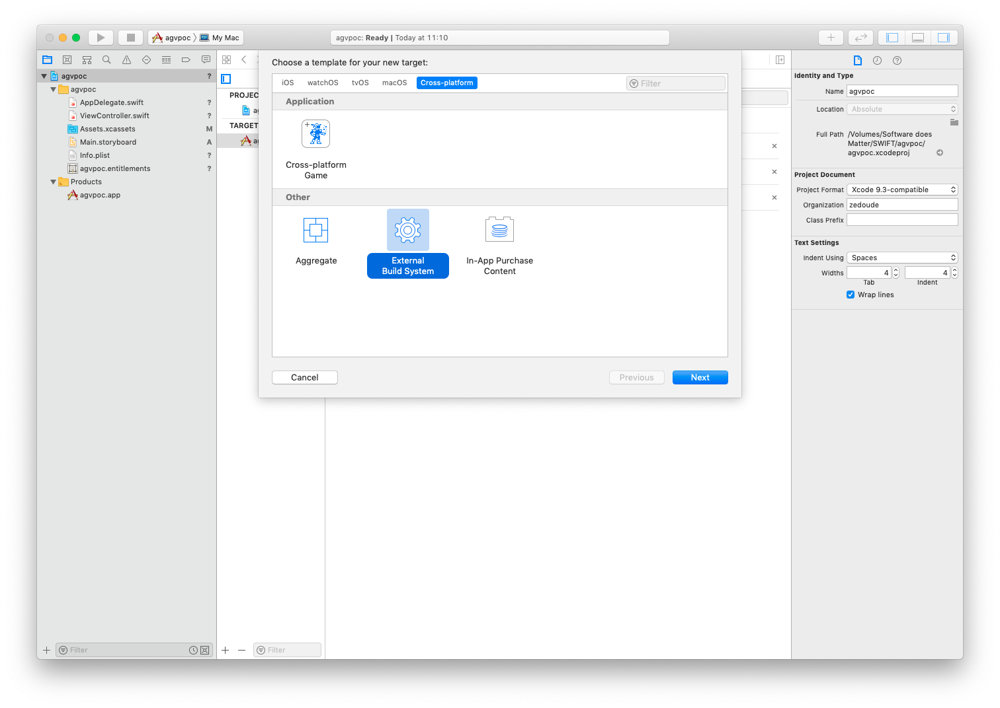

# README
Xcode doesn't to have a direct action to increase the build number of a project. We'll describe the steps to add a target to a Xcode project to do just that. The macOS application project template has an *About* window already configured to display the marketing version and the build number and doesn't require any extra coding.

We'll use a demonstration project named `agvpoc` to illustrate the few steps necessary to add a target that automatically increases the build number when run.

## Create the `agvpoc` project

The `agvpoc` project is a macOS App Swift project as shown in the following two screenshots :

Save your project and you're (almost) done.

## Activate Apple Generic Versioning
Select the appropriate target of your project. In our example, it is the `agvpoc`(2) target of the `agvproject`(1) as shown below, then select the `Build Settings`panel (3) :

Look for the **Versioning** rubric and set **Current Project Version** to 1 to set the initial build number. It can be any other number, even a decimal number although agvtool will set it to the closest higher integer when next run.

Set **Versioning System** to **Apple Generic** (2).

We're almost done !

## Setup the `nextbuild` target
When run, the `nextbuild` target increases the variable **Bundle Version** value in the `Info.plist` file.

To create this target press the '+' sign at the bottom left of the **Editor area** when the project itself is selected in the **Navigation area**.

Choose the **External BuildSystem** target template of the Cross-platform category.

Set the **Product Name** to whatever suits you, I choose **extbuild**.

Select `nextbuild` target, go into the `Info` tab and set the `Arguments` field to :

		-c "cd $PROJECT_DIR; xcrun agvtool next-version -all"
		

## Moving to the next build

To increment the build value, select the `nextbuild>run` scheme in the scheme chooser and press the `Run App` button.

Before :

After :

And that's it !
